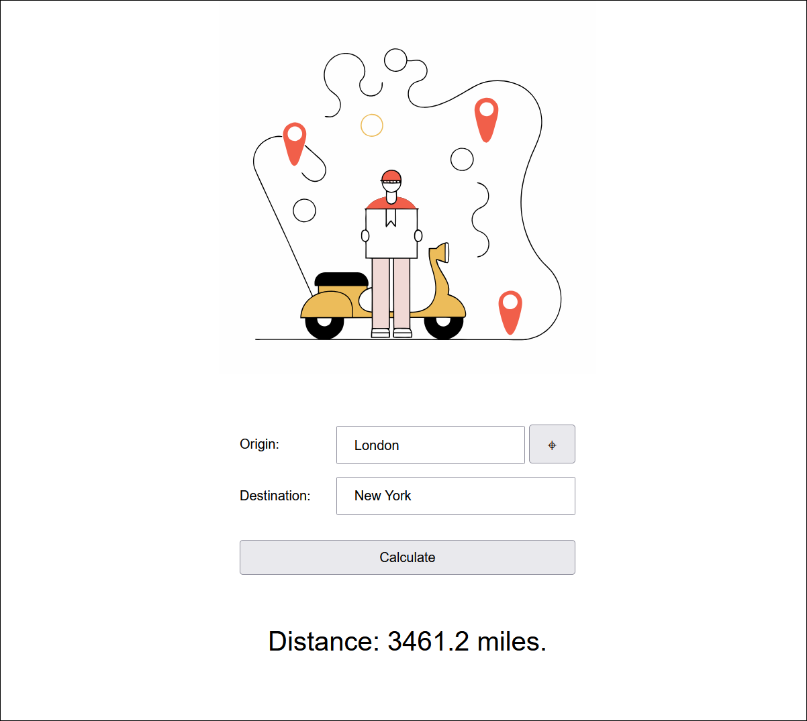

# Geolocation Playground

Ruby on Rails 8 playground application to learn about the [geocoder gem](https://github.com/alexreisner/geocoder) and the [browser geolocation API](https://developer.mozilla.org/en-US/docs/Web/API/Geolocation_API).

## Usage

The client can allow the application to receive their geolocation from the browser or enter an arbitrary origin value.

The client can then enter a destination value and calculate the distance in miles.

## Showcase

